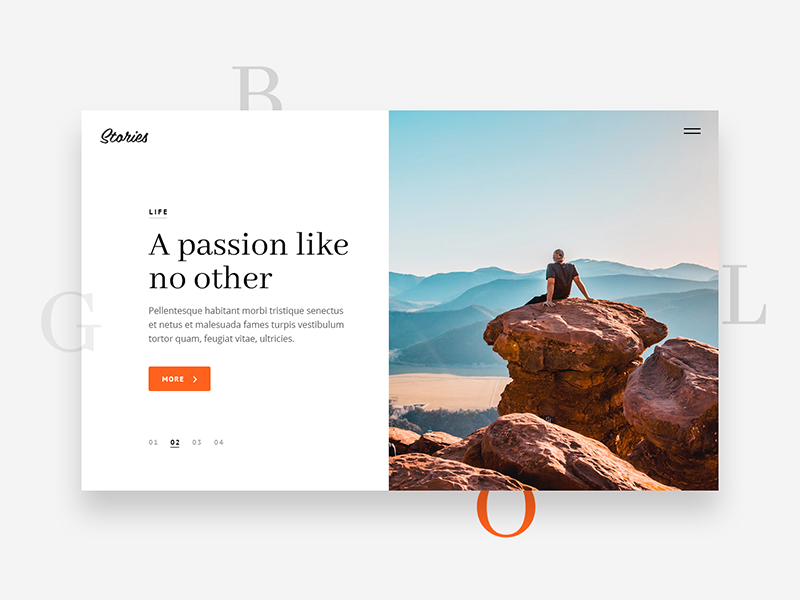
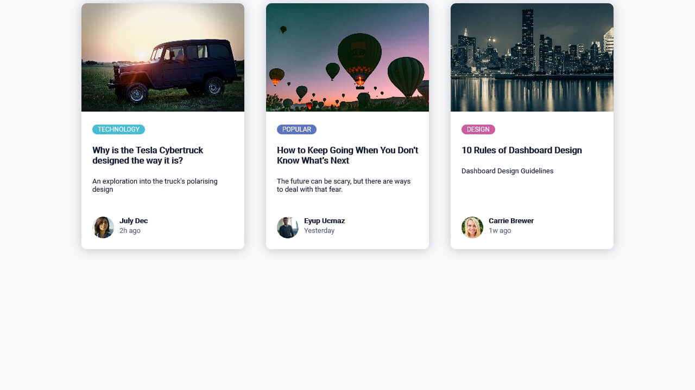

# Bài tập

## Bài tập trên lớp

## Bài tập về nhà

- Dùng create-react-app để tạo Todo List app ( hoặc có thể dùng lại project đã có sẵn)
- Tạo trang Home page của app dựa trên UI như hình
- Áp dụng css để style UI, áp dụng BEM để đặt tên cho class phù hợp (nếu dùng className)
- Phân tích UI, tạo ra các Component  UI phù hợp, từ bao quát đến chi tiết, ví dụ:
- Từng dòng task trong list task có thể thay bằng task item component
- Title lớn của app có thể thay bằng title component
tạo ra component lớn như task list để chứa các task item
...
- Phân tích logic, xác định props cần truyền vào cho mỗi component, hoàn thiện component để có thể sử dụng cho nhiều trường hợp khác nhau, nhiều chỗ khác nhau

